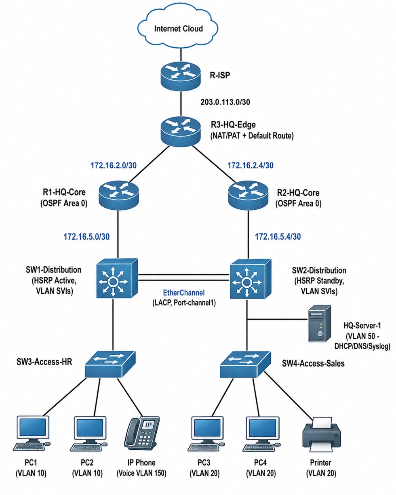

# Meridian Enterprise Network — v1.0

A secure, dual-core, dual-distribution enterprise campus network, built and fully verified in Cisco Packet Tracer and EVE-NG. This is v1.0 of an ongoing, multi-stage project — future versions will extend this into a multi-site WAN (CCNP-level) and eventually a Zero-Trust security architecture (post CCIE / security specialization).

**Author:** Omkar Patil

## Overview

Meridian Enterprise Network simulates a small headquarters site for a growing company, with a three-tier design (Core → Distribution → Access) built for redundancy and department-level security. Every VLAN gateway is protected by HSRP, the distribution layer is bonded with EtherChannel, all routing runs single-area OSPF, and department traffic is isolated by extended ACLs. Internet access flows through PAT overload on the edge router, and every device is locked to SSH-only management with a source-restricted access list.

## Topology



*(A screenshot of the network actually built and running in Cisco Packet Tracer is available at [`topology/meridian-topology-built-in-PT.png`](topology/meridian-topology-built-in-PT.png).)*

## Architecture & Features

| Layer | Technology | Purpose |
|---|---|---|
| Core | Dual routers (R1, R2), single-area OSPF | Backbone routing with equal-cost dual paths |
| Edge | R3-HQ-Edge | Internet gateway — PAT overload, static default route, OSPF `default-information originate` |
| Distribution | Dual L3 switches (SW1, SW2) | VLAN inter-routing via SVIs, HSRPv2 gateway redundancy, LACP EtherChannel between them |
| Access | SW3 (HR), SW4 (Sales) | Port security (sticky MAC, max 2, restrict), PortFast + BPDU Guard, DHCP snooping |
| Services | Centralized DHCP server (HQ-Server-1) | DHCP relay (`ip helper-address`) from distribution SVIs to a single DHCP/DNS/Syslog server |
| Security | SSH-only management, standard + extended ACLs | Management-plane ACL restricting VTY access to the internal subnet; extended ACL enforcing HR-to-Sales isolation |

### IP addressing
- 5 VLANs: HR (10), Sales (20), Servers (50), Management (99), Voice (150)
- Dual-stack HSRP virtual gateways per VLAN, SW1 active (priority 110), SW2 standby (priority 105)
- Full VLSM addressing plan under `172.16.0.0/16`

Full configs for every device are in [`/configs`](configs/). Full verification command output is in [`/verification/verification-outputs.txt`](verification/verification-outputs.txt).

## Security Note

All credentials in this repository are lab-only placeholders used in a simulated Cisco Packet Tracer environment and are not used in any production system. Passwords are stored as hashed values (Cisco type 5, MD5-based) rather than plaintext, consistent with real-world configuration hygiene, though this hash type is not considered cryptographically strong by modern standards and would not be used for production secrets.

## Verification Summary

- ✅ OSPF: both core routers reach `FULL` adjacency with the edge router, dual equal-cost paths confirmed
- ✅ HSRP: SW1 Active / SW2 Standby confirmed on all 5 VLANs, correct virtual IPs
- ✅ EtherChannel: `Po1(SU)` — both physical links bundled and up via LACP
- ✅ NAT/PAT: internal PCs successfully translate to the edge router's single public IP
- ✅ DHCP: all four end-user PCs received correct leases from the centralized DHCP server via relay
- ✅ ACL segmentation: HR blocked from reaching Sales, while server/internet access remains open

Full output for each of these is documented in [`verification-outputs.txt`](verification/verification-outputs.txt).

## Challenges Solved

Real debugging encountered and resolved during the build — documented here because working through these is what actually built the understanding, not just typing configs from a guide.

1. **BPDU Guard on a switch-to-switch trunk port.** Initially applied PortFast + BPDU Guard to a port later found to be an inter-switch trunk (not an end-host port). The switch correctly err-disabled the port the instant it received a legitimate BPDU. Root-caused by checking the actual physical topology against the port config, removed PortFast/BPDU Guard from the trunk, and manually recovered the err-disabled port.

2. **EtherChannel trunk negotiation failure.** `switchport mode trunk` was rejected on a Port-channel interface because trunk encapsulation defaulted to "Auto" on the 3560 platform (unlike the 2960s, which are 802.1Q-only and don't expose the command at all). Fixed by explicitly setting `switchport trunk encapsulation dot1q` before enabling trunk mode — a platform-specific IOS behavior worth knowing for real-world 3560/3750 deployments.

3. **Silent OSPF network-statement gap.** VLAN 10 was completely missing from the OSPF-learned routing table on the edge router, despite the distribution switches showing correctly configured VLAN SVIs and neighbor adjacencies. Root cause: an incorrect `network` statement was advertising the Management VLAN's subnet instead of HR's. Diagnosed by comparing `show ip route ospf` output against the actual VLAN addressing table, subnet by subnet, rather than assuming the config was correct because it "looked" right.

4. **Missing default route caused by an unconfigured upstream device.** A static default route on the edge router refused to install into the routing table even though the command was accepted with no error — because its next-hop (the ISP router) hadn't been configured yet and was unreachable. Cisco IOS silently declines to install a static route it can't verify. Fixed by bringing up the ISP-side interface first, confirming the dependency chain rather than re-typing the same command repeatedly.

5. **DHCP relay to a centralized server failing with no error anywhere.** The most involved troubleshooting chain in the project: DHCP requests were confirmed (via Packet Tracer's Simulation mode packet trace) to correctly reach the distribution switches as Layer 2 broadcasts, but no lease was ever issued. Systematically ruled out: DHCP snooping interference, stale switch state (cleared with a full reload), the relay-target switchport's VLAN assignment (found and fixed — the server's access port had never been assigned to VLAN 50), and the server's own IP configuration — before finally finding the actual root cause: the DHCP service on the server itself was toggled **Off**. A reminder that "everything downstream is configured correctly" is worth confirming before assuming the config is broken — sometimes the service just isn't switched on.

## Roadmap

This is v1.0 of a planned multi-stage project:
- **v2.0 (CCNP):** second site, multi-area OSPF, GRE/DMVPN, IPv6 dual-stack (OSPFv3), QoS, automation (Python/Ansible)
- **v3.0 (CCIE):** BGP multihoming, MPLS/SD-WAN overlay, spine-leaf data center block, infrastructure-as-code
- **v4.0 (Security capstone):** Zero-Trust integration — 802.1X NAC, next-gen firewall zones, IDS/IPS, centralized SIEM, VPN remote access, hybrid cloud connectivity

## Files

```
meridian-enterprise-network/
├── README.md
├── Meridian_Enterprise_Network_v1.pkt      <- open with Cisco Packet Tracer 8.2+
├── topology/
│   ├── meridian-topology-clean.png
│   └── meridian-topology-built-in-PT.png
├── configs/
│   ├── R1-HQ-Core.txt
│   ├── R2-HQ-Core.txt
│   ├── R3-HQ-Edge.txt
│   ├── SW1-Distribution.txt
│   ├── SW2-Distribution.txt
│   ├── SW3-Access-HR.txt
│   └── SW4-Access-Sales.txt
└── verification/
    └── verification-outputs.txt
```

**Note:** the `.pkt` file requires [Cisco Packet Tracer](https://www.netacad.com/courses/packet-tracer) (free with a Cisco NetAcad account) to open and view interactively.
